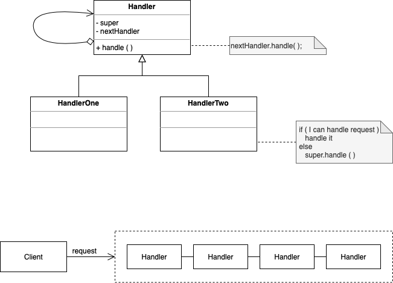

# Chain of Responsibility

. Consists of a source of command objects (messages) and a series of processing objects (receivers)

. Each processing object contains logic that defines the types of command objects that it can handle, the rest are passed to the next processing object in the chain

. It has a potential variable number of "handler" or "processing" elements/objects, and a stream of requests that must be handled. Efficiently process the request without hard-wiring handler relationships and precedence.

. Encapsulates the processing inside a "pipeline" abstraction. Client leaves request at the entrance of the pipeline 

. Chains the receiving objects together, then passes any request message from object to object until it reaches an object capable of handling the message. 

. Uses recursive composition to allow an unlimited number of handlers to be linked.

. Each sender keeps a single reference to the head of the chain, and each receiver keeps a singe reference to its immediate successor in the chain.

. Have a "safety net" to catch any requests that goes unhandled

. Multiple handlers could contribute to the handling of each request. The request can be passed down the entire length of the chain, with the last link being careful not to delegate to a "null next" 

