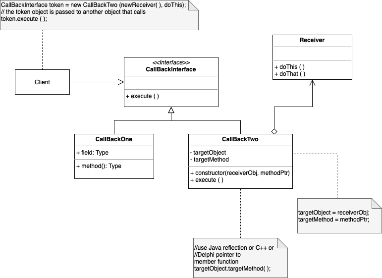

# Command

. Encapsulates command requests as an object.

. An object is used to encapsulate all information needed to perform an action or trigger an event at a later time. 

. Issue requests to objects without knowing anything about the operation being requested or the receiver of the request. 

. Decouples the object that invokes the operation to the one that performs the operation

. An abstract base class maps a receiver ( an object) with an action (a pointer to member function) 

. The base class contains an execute method that simply calls the action on the receiver

. Clients of Command objects invokes the object's virtual execute method whenever necessary

. Command class: an object, a method to be applied to object, arguments to be passed to method. command execute method bring pieces together. 

. Use: GUI buttons and menu items, Mobile code, Wizards

