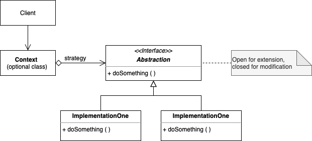

# Strategy

. Encapsulates an algorithm inside a class.

. Define a family of algorithms, encapsulate each one, and make them interchangeable. Strategy lets the algorithm vary independently from the clients that use it.

. Capture the abstraction in an interface, bury the implementation details in derived classes.

