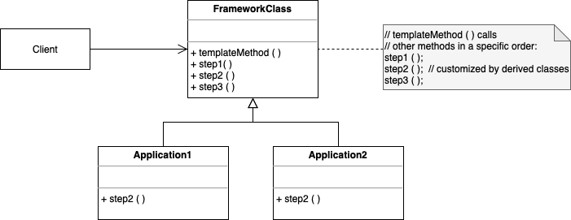

# Template Method

. Defines the program skeleton of an algorithm in an operation, deferring some steps to subclasses.

. It lets one redefine certain steps of an algorithm without changing the algorithms structure.

. Provides a template that implements the essential part of a process with some placeholders that allows derived classes to override.

. Steps that are considered invariants are implemented inside the base class. Steps that are considered to be variant, are given a default implementation or none, and they should be overridden in the derived classes. 

. Used prominently in frameworks.

. Inversion of Control - IoC - structure, where the base class has the thread of control. "The Hollywood principle" - " Don't call us, we'll call you". the Framework calls your application.

