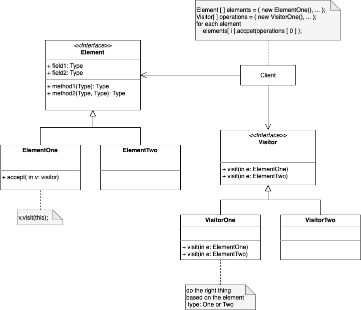

# Visitor

. Defines a new operation to a class without change

. Represent an operation to be performed on the elements of an object structure. Visitor lets you define a new operation without changing the classes of the elements on which it operates. 

. It has a "universal method adapter". The implementation of accept() in each element derived class is always the same. 

