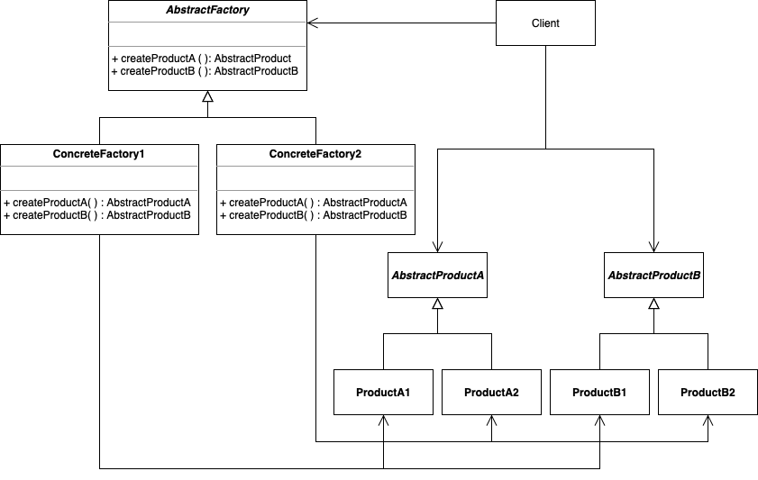

# Abstract Factory

. Creates an instance of several families of classes

. Provides an interface for creating families of related or dependent objects without specifying their concrete classes.

. Encapsulates a group of individual factories that have a common theme without specifying their concrete classes.

. Classes that participate to this pattern: AbstractFactory, ConcreteFactory, AbstractProduct, ConcreteProduct, and Client 

. Example: NYCheeseFactory, CACheeseFactory(), Cheese(), FetaCheese(), CheddarCheese()

