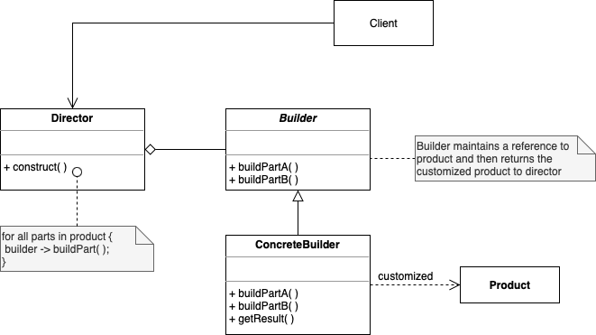

# Builder

. Builder specifies abstract interfaces for creating parts of a complex Product Object, step by step

. Separates the construction from its representation, same construction process can create different representations

. Goal: Create an instance of a product that needs to be customized in many different ways

. 4 basic classes: Builder, ConcreteBuilder, Director, Product

. Example: Fast Food creating a kid's meal

