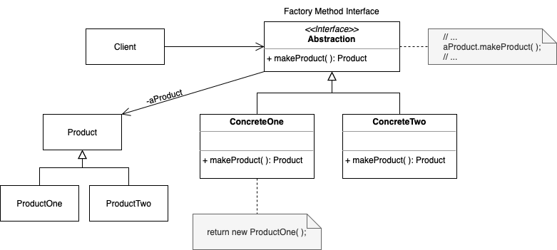
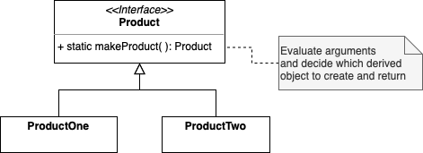

# Factory Method

. Creates an instance of several derived classes

. Define an interface for creating an object, but let subclasses decide which class to instantiate

# Static Factory Method

A static method of a class that returns an object of that class' type

Benefit: client code is independent of child classes

