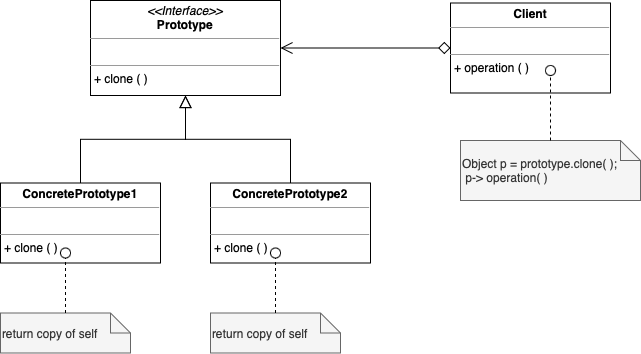

# Prototype

. Specify kinds of objects to create using a prototypical instance, and create new objects by copying this prototype

. Avoid the inheritance cost of creating new object in the standard way (using 'new')

