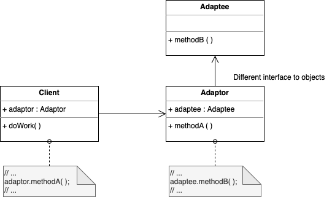
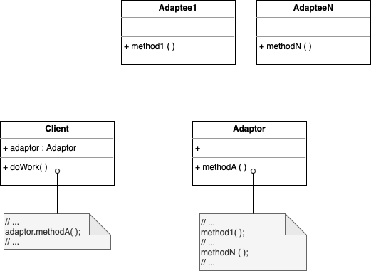

# Adapter

. Convert the interface of a class into a new interface that client expects

. Lets classes work together that couldn't otherwise because if incompatible interfaces

. Wrap existing class with new interface, creating an intermediary abstraction that translates old into new system.

. Goal: reuse existing code to address mismatch/discrepancies of a component

## Object Adapter Pattern

. The adapter contains an instance of the class it wraps.

. The adapter makes the calls to the instance of the wrapped object

## Class Adapter Pattern

. The adapter uses multiple polymorphic interfaces implementing or inheriting both the interface that is expected and the interface that is preexisting.

. Make your adaptor as a child class of all the classes you want to reuse.

