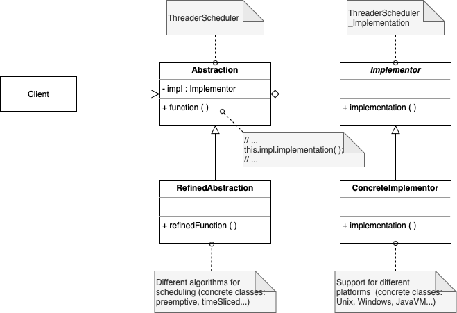

# Bridge

. Decouples an abstraction from its implementation so that the two can vary independently.

. 2 layers of abstraction: what it does (operations it supports), how it does (implementation varies)

. Encapsulates an implementation class inside of an interface class

. Example: Thread scheduling

. Uses: 

  - runtime binding of the implementation

  - shared implementation among multiple objects

  - separate class hierarchies, abstract from concrete implementation, to avoid using inheritance to represent different variations, avoiding proliferation of classes

. Consequences: 

  - decoupling object's interface 

  - extensible

  - hide details from client

