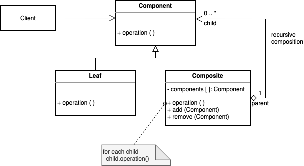

# Composite

. Using a common interface, a group of objects is to be treated in the same way as a single instance of an object

. An abstract base class (Component) specifies the behavior that needs to be exercised uniformly across all primitive and composite objects

. Each composite object "couple" itself only to the abstract type Component as it manages its "children"

.Composites contain components, each of which could be another composite

