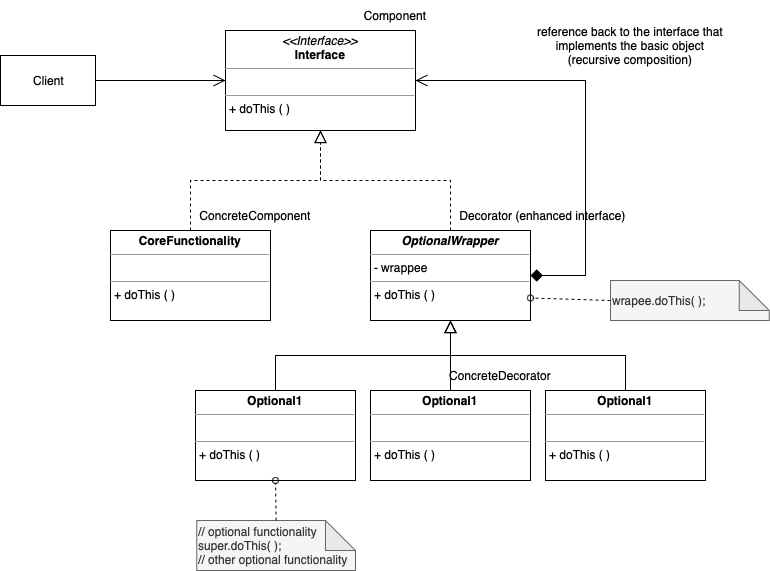

# Decorator

. Allows behavior to be added to an individual object, either statically or dynamically, without affecting the behavior of other objects from the same class.

. New capabilities added on top of the capabilities of the original object, enhances object's responsibilities 

. Example: tree and ChristmasTree; Window and HorizontalWindow/VerticalWindow...

