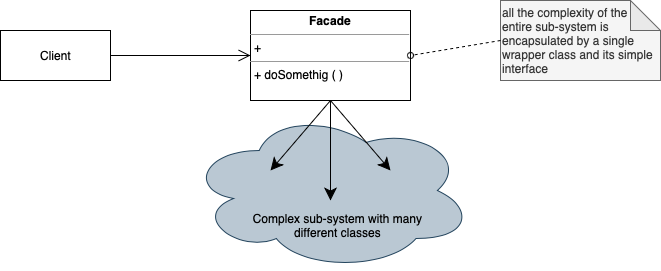

# Facade

. Provides a unified interface to a set of interfaces in a subsystem. It's a higher-level interface that makes the subsystem easier to use.

. Wraps around several classes of a massive/complex subsystem to make a easier/clearer/simpler interface to the client/user

. Offers an entry point to the whole system

. May want to create multiple facades for user interaction (for different purposes) 

