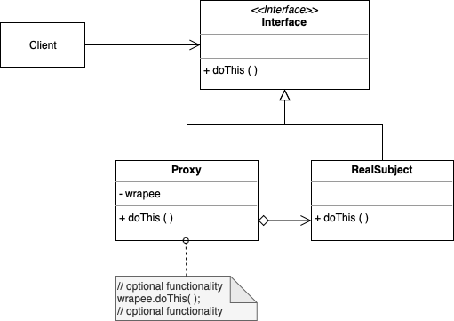

Proxy

. A proxy object represents another object, a wrapper or agent object that is called by the client to access the real subject

. A class that function as an interface to something else, a placeholder for another object to control access to it

. Example: a check is a proxy representing real money in the bank, a real site agent represents the seller

. Common applications: 

  1. virtual proxy is a placeholder for "expensive to create" objects, so the real object is created only when the client first requests it

  2. remote proxy provides a local representative for an object that resides in a different address space

  3. a protective proxy controls access to a sensitive master object. The "surrogate" object checks that the caller has the access permissions required prior to forwarding the request

  4. a smart proxy interposes additional actions when an object is accessed 

